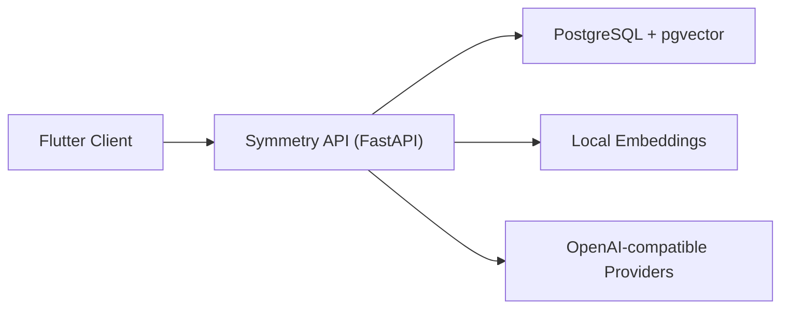
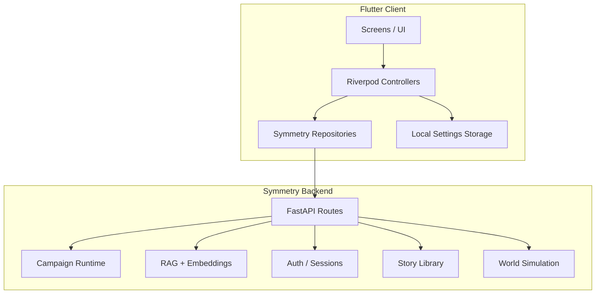
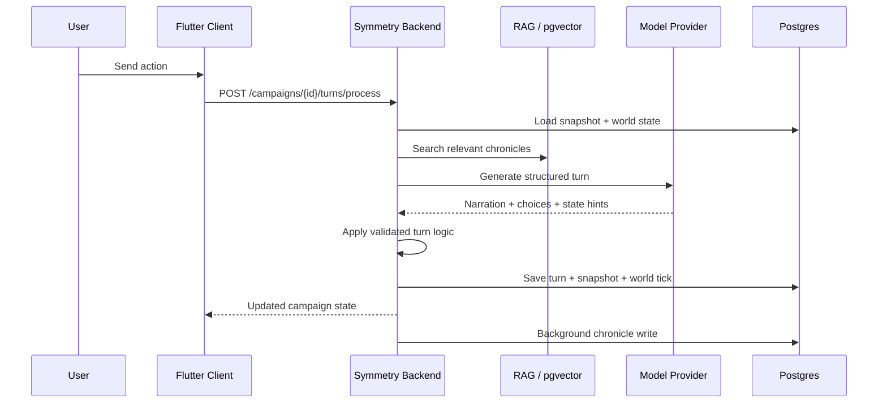

# Архитектура: server-first `AI_PRG + Symmetry`

## 1. Верхнеуровневая схема

## 2. Источники истины

1. `Symmetry` является источником истины для:
   - пользователей;
   - сессий;
   - кампаний;
   - snapshot-ов;
   - ходов;
   - состояния мира;
   - векторной памяти;
   - story library.
2. Flutter не является источником истины для кампаний и мира.
3. LLM не является источником истины для игровых изменений.
4. Изменения кампании применяются только через серверную игровую логику.

## 3. Клиентская декомпозиция

## 4. Клиент

### 4.1 Что осталось в Flutter

1. UI и навигация.
2. Авторизационный gate.
3. Отображение состояния кампании.
4. Локальные настройки UI и языка.
5. Локальная server session.
6. Пользовательские AI-ключи, если пользователь сам их ввёл.

### 4.2 Чего больше нет в runtime-потоке клиента

1. Локального campaign persistence как продуктового сценария.
2. Локального authoritative save/load-flow для кампаний.
3. Локального primary turn-processing flow.

## 5. Сервер

### 5.1 Основные зоны backend

1. `app/api/routes/*`:
   - auth
   - campaigns
   - prompts
   - providers
   - stories
2. `app/services/*`:
   - auth
   - credentials
   - AI gateway
   - prompt generation
   - campaign runtime
   - simulation
   - RAG
   - embeddings
3. `app/db/*`:
   - SQLAlchemy models
   - async session
   - DB startup check
4. `alembic/*`:
   - schema migrations

### 5.2 База данных

Основные группы таблиц:

1. auth:
   - `users`
   - `user_profiles`
   - `auth_identities`
   - `auth_sessions`
2. campaigns:
   - `campaigns`
   - `campaign_members`
   - `campaign_snapshots`
   - `campaign_turns`
3. world:
   - `world_state`
   - `world_locations`
   - `world_factions`
   - `world_chronicles`
   - `simulation_ticks`
4. story library:
   - `story_templates`
   - `story_template_tags`
   - `story_template_tag_links`
   - `story_template_likes`
   - `story_template_views`
   - `story_template_bookmarks`
5. billing-ready:
   - `billing_customers`
   - `billing_plans`
   - `billing_subscriptions`
   - `credit_ledger`
   - `payment_events`

## 6. Игровой цикл

## 7. AI-доступ и креды

1. По умолчанию backend использует свои креды из `.env`.
2. Если пользователь ввёл свои AI-креды в приложении:
   - Flutter хранит их только локально;
   - отправляет их в backend только для конкретной AI-операции;
   - backend использует их transiently;
   - backend не сохраняет их в БД, логах, snapshot-ах или background jobs.
3. Проверка и выбор источника кредов идут через
   `CredentialResolutionService`.

## 8. Локальное хранение на клиенте

Локальное хранилище в клиенте остаётся только для:

1. настроек приложения;
2. языка;
3. server base URL;
4. server session;
5. пользовательских AI-ключей.

Это больше не campaign storage.

## 9. Миграции и rollout

1. Схема БД обновляется через `Alembic`, а не через `create_all`.
2. Локально и на сервере используется один и тот же шаг:
   - `alembic upgrade head`
3. Контейнер backend выполняет миграции перед запуском API.
4. Безопасный rollout-порядок:
   - backup БД;
   - применить миграции;
   - поднять новую версию backend;
   - проверить `/health` и ключевые API.

## 10. Инварианты

1. AI output недоверенный до валидации.
2. Свободный текст модели не применяется напрямую к state.
3. Пользовательские provider credentials не должны попадать в persistence.
4. Важные события кампании попадают в `world_chronicles` только после
   серверного отбора важности.
5. Любое изменение схемы БД должно идти через миграцию.
