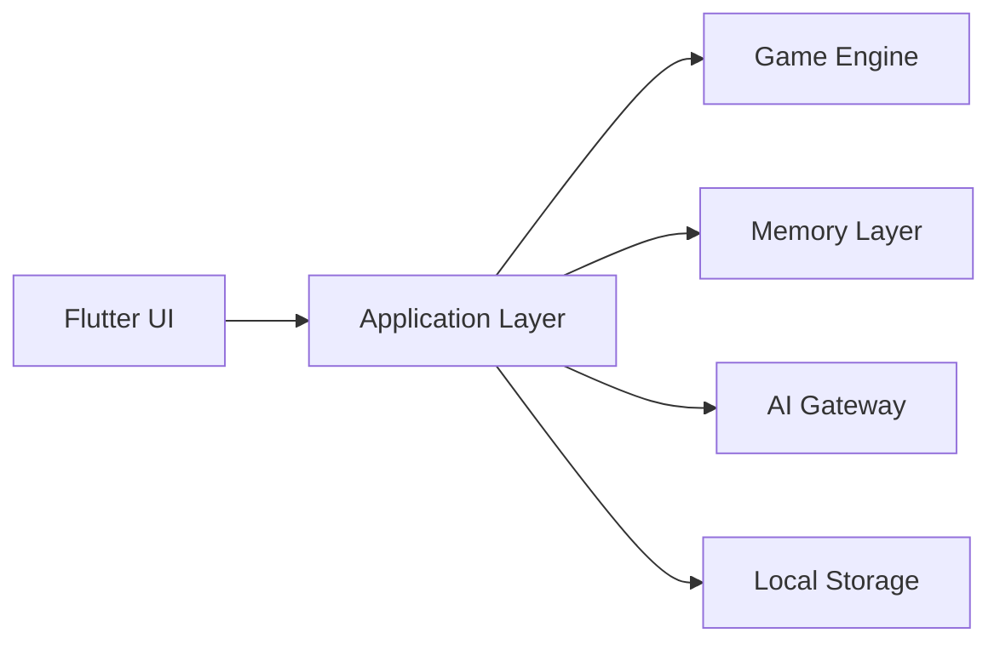
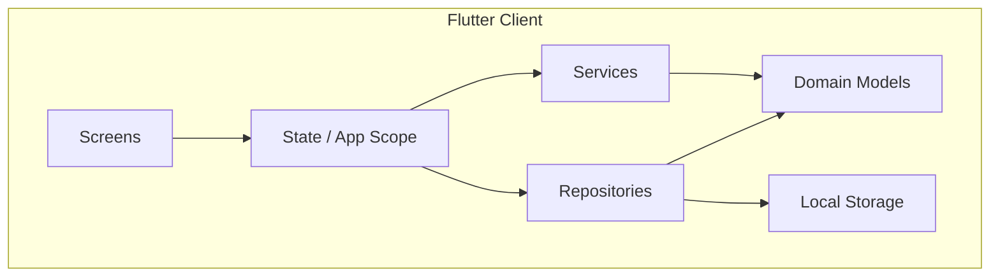
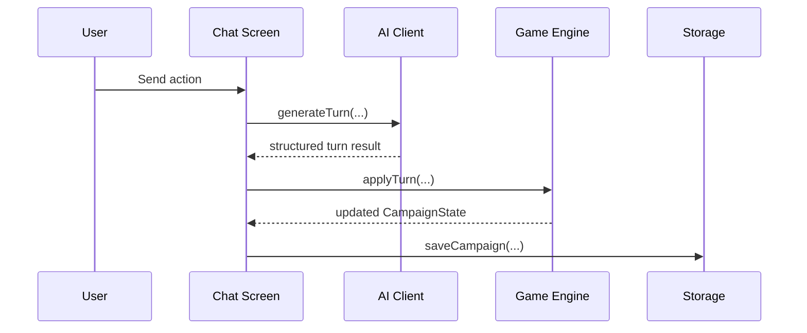

# Архитектура: схема модулей

## 1. Модули верхнего уровня

## 2. Клиентская декомпозиция

## 3. Основные архитектурные правила

1. UI не является источником истины для игрового состояния.
2. AI не является источником истины для игрового состояния.
3. Игровой state изменяется только через детерминированную логику приложения.
4. AI-слой работает через единый gateway и structured contract.
5. Память кампании строится слоями: recent turns, rolling summary, active goal, active situation.

## 4. Ключевые модули текущего MVP

1. `lib/src/app/*` — bootstrapping, app scope, theme, localization.
2. `lib/src/core/models/*` — доменные модели кампании, персонажа, AI settings.
3. `lib/src/core/repositories/*` — локальные репозитории настроек и кампаний.
4. `lib/src/core/services/*` — game engine, AI clients, LM Studio auto-config, memory manager.
5. `lib/src/features/*` — пользовательские экраны и feature-level UI.

## 5. Игровой цикл

## 6. Сохранения и совместимость

1. Кампания хранится как сериализуемая модель состояния.
2. Изменения схемы должны по возможности сохранять обратную совместимость.
3. Новые поля memory-слоя должны иметь fallback для старых save.

## 7. AI слой

1. Поддерживается OpenAI-compatible endpoint.
2. LM Studio используется как локальный AI provider.
3. Для LM Studio поддержан fast mode через `/no_think` с fallback.
4. Невалидный AI-ответ не должен ломать state кампании.
