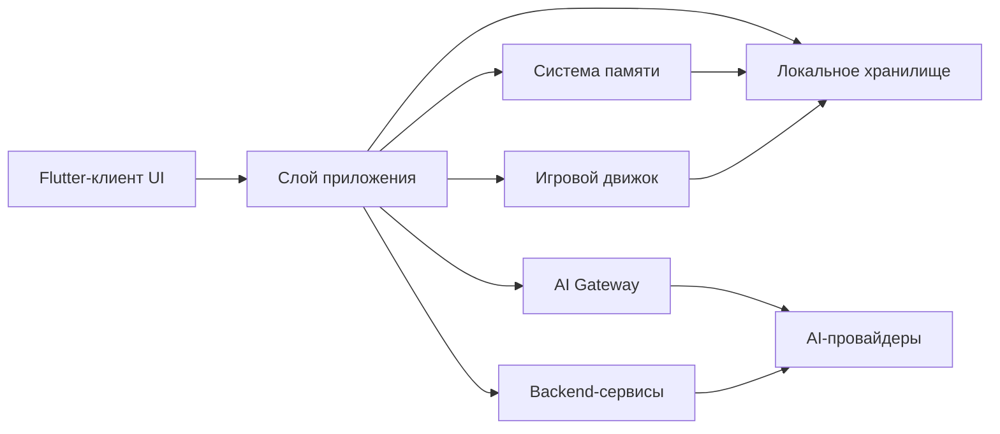
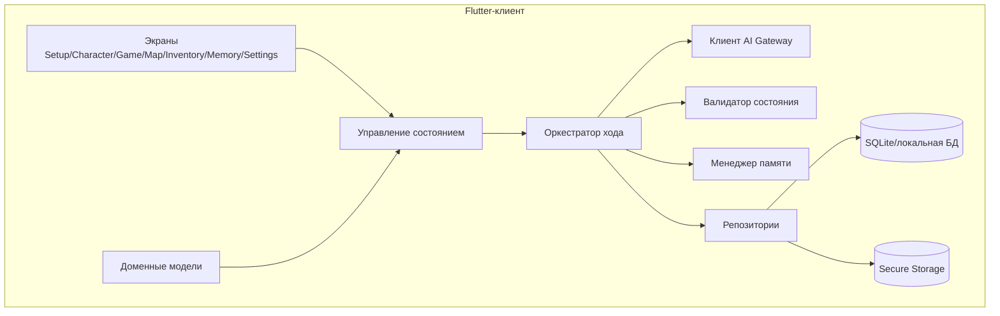
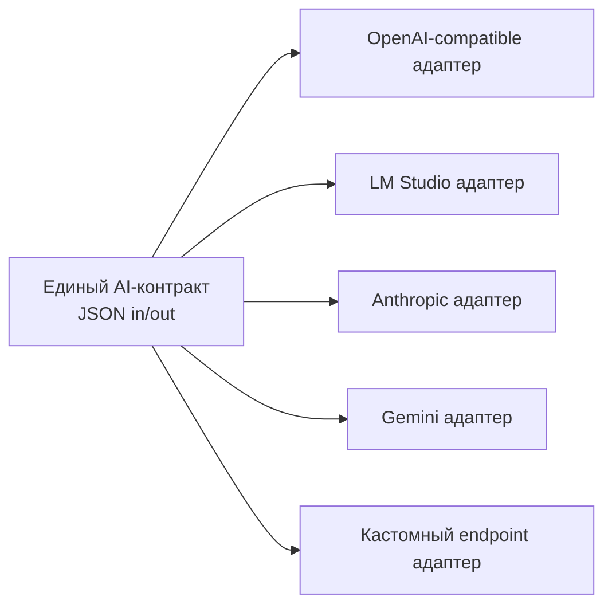
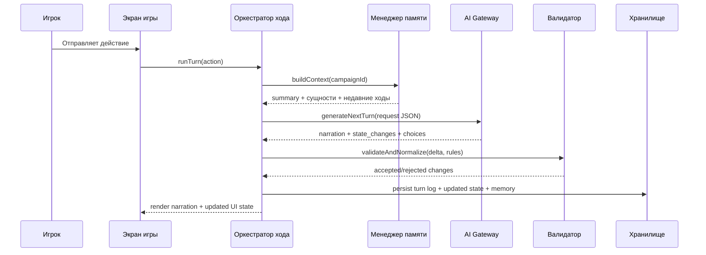

# Архитектура: Схема модулей

## 1. Модули верхнего уровня

## 2. Декомпозиция клиентских модулей

## 3. Адаптеры AI Gateway

## 4. Конвейер обработки хода

## 5. Матрица ответственности
1. `Screens/UI`: рендеринг, ввод игрока, локальное UI-состояние.
2. `Turn Orchestrator`: центральный use-case поток каждого хода.
3. `State Validator`: принудительное соблюдение детерминированных правил игры.
4. `Memory Manager`: cadence summaries, карточки сущностей, сбор контекста.
5. `AI Gateway`: абстракция провайдеров и нормализация ответа.
6. `Repositories/Storage`: сохранение данных и миграции схем.
7. `Backend`: прокси встроенного ключа, entitlements, аналитика, модерация, облачные сохранения.

## 6. Владение данными
1. Источник истины состояния игры: `игровой движок + сохраненное состояние`.
2. Выход AI: недоверенный proposal до подтверждения валидатором.
3. Канон памяти: обновляется подсистемой памяти, не напрямую из UI.
4. Состояние подписки/прав: authoritative на backend.

## 7. Стратегия версионирования
1. `prompt_version` в AI-запросах.
2. `schema_version` в каждой сохраненной сущности.
3. `ruleset_version` в метаданных кампании.
4. Backward-compatible парсер логов ходов там, где это возможно.
