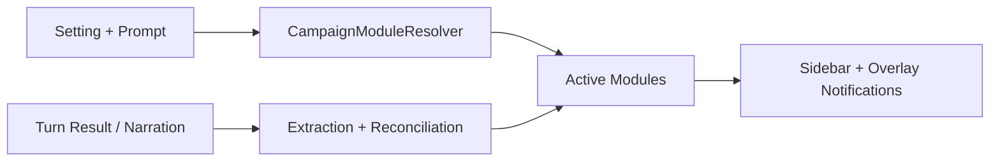

# Architecture Plan: Campaign Modules

## 1. Контекст

Перед началом изучить:

- [PRD.md](D:/AI_PRG/PRD.md)
- [Architecture.md](D:/AI_PRG/Architecture.md)
- [FlutterRules.md](D:/AI_PRG/FlutterRules.md)
- [.specify/memory/project-context.md](D:/AI_PRG/.specify/memory/project-context.md)
- [.specify/memory/project-settings.md](D:/AI_PRG/.specify/memory/project-settings.md)
- [docs/features/engine-mechanics-token-control/02-PRD.md](D:/AI_PRG/docs/features/engine-mechanics-token-control/02-PRD.md)

## 2. Цель этапа

Определить, как встроить модульную модель кампании в текущую архитектуру так, чтобы:

- не навязывать всем историям `Gold`, `Exp`, `Level`, combat UI и похожие RPG-поля;
- по-прежнему хранить мир структурированно и локально;
- разрешить истории постепенно "раскрывать" новые игровые системы;
- синхронизировать state, extraction, sidebar и transient notifications.

## 3. Вопросы архитектора

### Где в текущей архитектуре должна жить фича?

- **Domain models**: новая модель `CampaignModules` и module-specific state slices.
- **New Game flow**: рекомендации и первичная активация модулей по `setting` и prompt.
- **Turn orchestration**: extraction, reconciliation и runtime-activation модулей.
- **Persistence**: structured storage для активных модулей и их сущностей.
- **Chat UI**: модульный sidebar и transient overlays с изменениями состояния.

### Какие модели, репозитории, сервисы и экраны будут затронуты?

Основные зоны:

- `campaign_models.dart` или новые domain-модели world-state modules;
- `game_engine.dart` / будущий reducer layer;
- `campaign_storage_mapper.dart`, `isar_collections.dart`, local data source;
- `new_game_controller.dart` и `new_game_screen.dart`;
- `chat_controller.dart` и `chat_screen.dart`;
- будущие `EntityExtractionService`, `CampaignModuleResolver`, `WorldStateNotifier`, `StateChangeOverlayService`.

### Нужны ли миграции данных или изменения save/load?

Да, но без разрушения старых кампаний.

Рекомендуемая стратегия:

1. Ввести `schemaVersion` для module-aware state.
2. При миграции существующих кампаний:
   - текущие `inventory` и `questLog` завернуть в соответствующие модули;
   - текущие `hp/energy` считать признаком активного `Vitality` module;
   - `Companions`, `Resources`, `Progression` по умолчанию не включать, если данных нет.
3. Для новых кампаний хранить активные модули явно, а не выводить их каждый раз эвристически.

### Как фича повлияет на AI-контракты, memory, локализацию и UX?

- **AI-контракт**: prompt должен знать, какие модули активны и какие state slices разрешено менять.
- **Memory/context**: в модель отправляется только relevant state активных модулей.
- **Extraction**: rule-based и future structured extraction работают только внутри активных модулей или могут предложить активацию нового.
- **Локализация**: названия модулей, уведомления, подписи side-panel, тексты activation prompts - на `ru/en`.
- **UX**: sidebar и overlays становятся адаптивными к кампании, а не едиными для всех жанров.

### Какие риски и trade-off есть у решения?

| Риск | Митигация |
|------|-----------|
| Слишком частая auto-активация модулей | пороги уверенности, whitelist триггеров, мягкие правила для high-impact modules |
| UI может стать "прыгающим" | модуль активируется редко, уведомление короткое, sidebar секция появляется с мягким highlight |
| Миграции старых save станут сложнее | backwards-compatible mapping и постепенный rollout |
| Prompt и extraction начнут расходиться | единый module registry и module-aware context builder |

## 4. Результат

### Архитектурное решение

Базовая схема:

- **Core state** всегда активен:
  - `campaign metadata`
  - `location`
  - `objective`
  - `memory summary`
  - `recent events`
- **Optional modules** подключаются поверх core state:
  - `Inventory`
  - `Companions`
  - `Notes`
  - `Vitality`
  - `Resources`
  - `Progression`
  - `Checks`

У каждого модуля есть:

- `moduleId`
- `activationStatus`
- `activationReason`
- `uiVisibility`
- `state payload`
- `extractors`
- `prompt exposure policy`

### Поток активации модуля

### Затронутые файлы и модули

- `lib/src/core/models/*`
- `lib/src/core/data/isar/*`
- `lib/src/core/services/*`
- `lib/src/features/new_game/*`
- `lib/src/features/chat/*`
- `docs/features/engine-mechanics-token-control/*`

### Риски

- Ложные срабатывания при extraction и module activation.
- Рост количества состояний в UI.
- Сложность согласования prompt, reducer и persistence.

### Границы этапа реализации

В scope:

- module registry;
- initial activation;
- runtime activation;
- module-aware state persistence;
- module-aware UI;
- lightweight notifications.

Вне scope первого среза:

- глубокая балансировка RPG-цифр;
- сложный drag-and-drop inventory;
- полноценный tactical combat UI;
- визуальный editor модульных правил.
