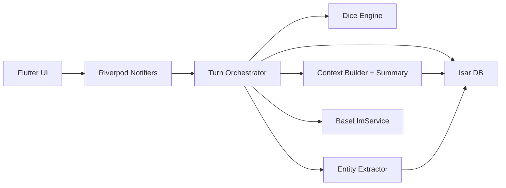

# Architecture: AI RPG Engine Core, Mechanics & Token Control

## 1. Контекст

Текущая реализация уже содержит рабочий MVP, но архитектурно остается ближе к desktop prototype:

- `CampaignRepository` хранит кампании целиком в `SharedPreferences`.
- `SettingsRepository` хранит AI settings там же.
- `ChatScreen` совмещает orchestration, загрузку, отправку хода, локальную анимацию "streaming" и сохранение.
- `GameEngine` детерминированно применяет `TurnResult`, но сами изменения мира пока в основном приходят из AI JSON.
- `CampaignMemoryManager` уже дает основу для hybrid context, но без пользовательского контроля окна контекста и без summary cadence.

## 2. Gap-анализ относительно нового PRD

### 2.1 Хранилище и Local-First

Сейчас:

- Полные JSON-объекты кампаний лежат в `SharedPreferences`.
- Нет индексируемых коллекций сообщений, предметов, спутников и настроек модели.
- Нет стратегии миграции под Web/WASM.

Нужно:

- Ввести `Isar` как primary storage.
- Разделить сущности на коллекции: `Campaign`, `Message`, `WorldState`, `InventoryItem`, `Companion`, `ModelPreset`, `ContextSnapshot`.
- Сохранить обратную совместимость через one-shot migration из старого JSON-формата.

### 2.2 State management

Сейчас:

- `AppScope` раздает зависимости.
- UI держит состояние экрана через `StatefulWidget`.
- Изменения в одной части экрана легко провоцируют широкие rebuild.

Нужно:

- Перейти на `Riverpod` с `Notifier/AsyncNotifier`.
- Разделить состояния как минимум на:
  - `activeCampaignProvider`
  - `campaignMessagesProvider`
  - `worldStateProvider`
  - `inventoryProvider`
  - `modelSettingsProvider`
  - `streamingTurnProvider`
- Использовать `.select()` для локальных обновлений active module state, HP, token limits и т.д.

### 2.3 Игровая модель

Сейчас:

- Есть `CharacterStats`, `inventory`, `questLog`, `memory`, `messages`.
- Отсутствует модульная схема для `resources`, `progression`, `companions` и других optional systems.
- Нет отдельного `WorldState` как агрегата источника истины.

Нужно:

- Ввести `WorldState` и версионировать схему.
- Развести:
  - immutable campaign metadata;
  - mutable world state;
  - append-only turn/message log.
- Сохранить текущие `might/wit/spirit` как вторичный слой характеристик, если они еще нужны gameplay/UI.

### 2.4 AI orchestration

Сейчас:

- Есть `AiClient`, но `generateTurn()` возвращает уже готовый результат целиком.
- HTTP идет без stream parsing.
- Визуальный streaming реализован через `_animatePendingNarration()` после получения полного текста.

Нужно:

- Ввести `BaseLlmService`/`LlmGateway` с двумя контурами:
  - `streamTurn()` для UI narration stream;
  - `completeStructuredTurn()` или parsing pipeline для финального `TurnResult`.
- Разделить narrative stream и deterministic post-processing.
- Сделать провайдер-независимую оркестрацию поверх OpenAI-compatible, Claude-compatible и локальных провайдеров.

### 2.5 Token and speed guard

Сейчас:

- В settings есть provider/baseUrl/model/apiKey/timeout/fast mode.
- Нет `max response tokens`.
- Нет `context window size`.
- Нет профиля модели "умная/дорогая vs быстрая/дешевая" как пользовательского управления.

Нужно:

- Вынести `ModelRuntimeSettings` в отдельную сущность:
  - `selectedModelId`
  - `maxResponseTokens`
  - `contextWindowSize`
  - `summaryEveryNTurns`
  - `streamingEnabled`
- Привязать эти настройки к prompt builder и transport layer.

### 2.6 Deterministic gameplay

Сейчас:

- AI возвращает `state_changes`.
- Детальный deterministic combat/dice layer отсутствует.

Нужно:

- Ввести локальный `DiceEngine`.
- Генерировать roll outcome до вызова AI.
- Передавать модели только результат проверки и контекст сцены.
- Ограничить право модели менять критичные поля напрямую в боевых/skill-check сценах.

### 2.7 Entity extraction

Сейчас:

- Изменения инвентаря приходят из structured JSON.
- Нет hidden extractor поверх raw narration.

Нужно:

- Добавить extractor pipeline:
  - rule-based patterns;
  - optional structured hints from model;
  - reconciliation against `WorldState`.
- Не применять extractor "в лоб" без confidence/rules, чтобы избежать ложных предметов и NPC.

## 3. Целевая модульная схема

## 4. Предлагаемая доменная модель

### 4.1 Основные сущности

- `CampaignEntity`
  - id, title, setting, mode, difficulty, createdAt, updatedAt
- `WorldStateEntity`
  - campaignId, location, objective, summary, activeModules, moduleStateVersion
- `CharacterSheetEntity`
  - campaignId, name, classId, stats, perks
- `MessageEntity`
  - id, campaignId, role, text, createdAt, turnNumber, isStreamPartial
- `InventoryItemEntity`
  - id, campaignId, key, title, quantity, tags
- `CompanionEntity`
  - id, campaignId, name, status, relation, notes
- `ModelSettingsEntity`
  - provider, model, maxResponseTokens, contextWindowSize, timeoutSeconds, fastMode
- `SummarySnapshotEntity`
  - campaignId, turnNumber, summaryText

### 4.2 Runtime services

- `TurnOrchestrator`
- `ContextAssemblyService`
- `StreamingResponseAssembler`
- `SummaryService`
- `EntityExtractionService`
- `DiceEngine`
- `WorldStateReducer`

## 5. Поток одного хода

1. UI отправляет action в `TurnOrchestrator`.
2. Orchestrator читает текущий `WorldState`, messages и runtime model settings из `Isar` через providers.
3. Если ход требует проверки, `DiceEngine` рассчитывает результат локально.
4. `ContextAssemblyService` собирает:
   - static header
   - dynamic summary
   - recent buffer
   - visible world state
   - optional roll outcome
5. `BaseLlmService.streamTurn()` отдает narrative stream в UI.
6. По завершении stream запускается deterministic post-processing:
   - structured parse
   - entity extraction
   - reducer world state
   - persistence в `Isar`
7. Riverpod-провайдеры публикуют точечные обновления UI.

## 6. Миграционная стратегия

### 6.1 SharedPreferences -> Isar

1. На первом запуске после обновления читаются старые `settings.ai`, `settings.app_language`, `campaign.ids`, `campaign.<id>`.
2. JSON-кампании конвертируются в новые коллекции `CampaignEntity`, `WorldStateEntity`, `MessageEntity`.
3. После успешной миграции выставляется `storage.schema_version = 2`.
4. Старые ключи не удаляются немедленно, пока миграция не пройдет успешно.

### 6.2 AI contract compatibility

- Сохранить поддержку текущего `TurnResult`.
- Добавить новый промежуточный контракт для streaming и extraction без ломки старых провайдеров.
- Для старых моделей или demo mode fallback остается current full-response path.

## 7. Основные технические риски

1. Одновременный переход на `Isar` и `Riverpod` слишком велик для одного PR.
2. Streaming и structured JSON плохо сочетаются, если ждать полный JSON в одном ответе.
3. Entity extraction по свободному тексту может вносить ложные изменения мира.
4. Dice system требует четкого разделения: что решает движок, а что только описывает модель.
5. Web/WASM поддержка `Isar` должна быть спроектирована заранее, а не как постфактум-перенос.

## 8. Архитектурная рекомендация

Внедрять не "big bang", а четырьмя слоями:

1. storage foundation (`Isar`, migrations, repository split);
2. runtime controls (`max_tokens`, `context_window`, real streaming);
3. hybrid context + extraction;
4. deterministic gameplay (`dice`, combat, UI world panels).

Именно такой порядок дает быстрый пользовательский выигрыш без массовой регрессии базового gameplay loop.
